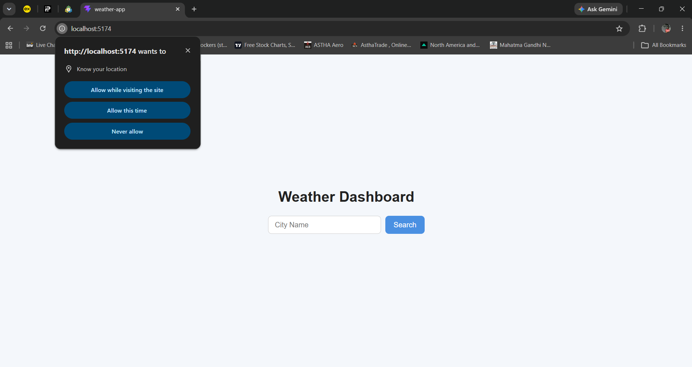
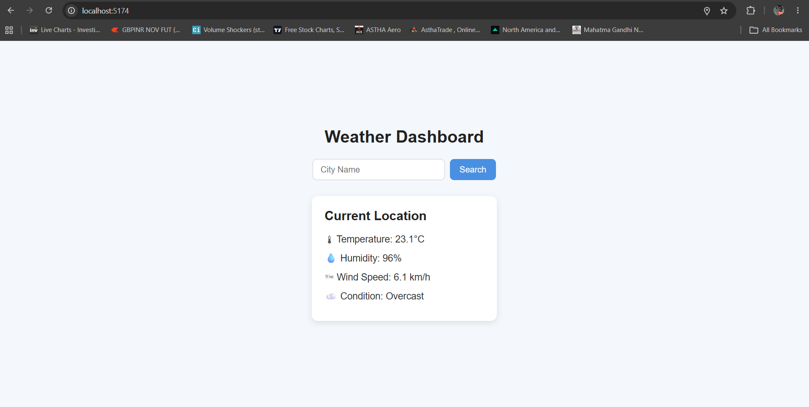
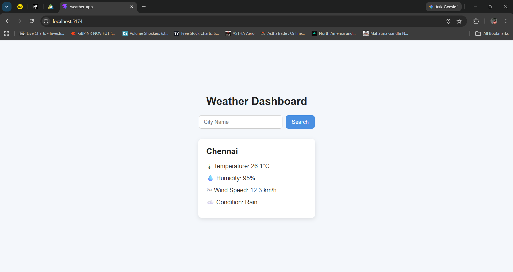
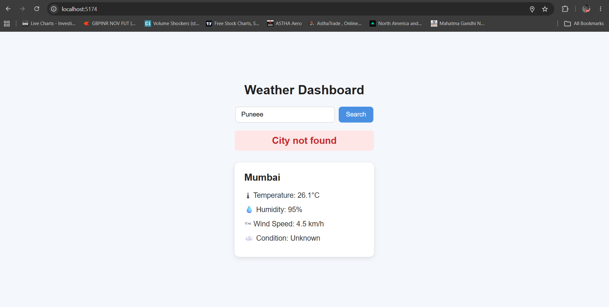

# React Weather Dashboard

A responsive weather application built with React and Vite to practice API integration, asynchronous programming, state management, and modern frontend development.

The application demonstrates data fetching from multiple APIs, geolocation support, controlled components, error handling, conditional rendering, accessibility practices, and clean code organization.

---

## Live Demo

Live Application: https://react-weather-dashboard-two-rho.vercel.app/

GitHub Repository: https://github.com/pradeepk1787/react-weather-dashboard

---

## Screenshots

### Home



### Home



### Search Result



### Error State



---

## ✨ Features

* ✅ Search weather by city name
* ✅ Fetch current location weather automatically
* ✅ Fallback to Mumbai when location access is denied
* ✅ Search using the Enter key
* ✅ Loading indicators during API requests
* ✅ Graceful error handling
* ✅ Weather condition mapping
* ✅ Accessible form controls using `aria-label`
* ✅ Prevent duplicate searches while loading
* ✅ Clean and responsive user interface

---

## Tech Stack

* React
* Vite
* JavaScript (ES6+)
* CSS3
* Open-Meteo Weather API
* Open-Meteo Geocoding API
* Browser Geolocation API
* Git & GitHub
* Vercel

---

## React Concepts Practiced

* Functional Components
* JSX
* `useState`
* `useEffect`
* Controlled Components
* Event Handling
* Keyboard Events (`onKeyDown`)
* Async / Await
* Fetch API
* Error Handling
* Data Transformation
* Conditional Rendering
* Separation of Concerns
* Single Responsibility Principle
* Accessibility using `aria-label`

---

## Project Structure

```text
react-weather-dashboard/
│
├── screenshots/
│   ├── home.png
│   ├── search-result.png
│   └── error.png
│
├── src/
│   ├── components/
│   │   └── Weather.jsx
│   │
│   ├── App.jsx
│   ├── App.css
│   └── main.jsx
│
├── package.json
├── vite.config.js
└── README.md
```

---

## What I Learned

During this project, I practiced:

* Working with external APIs using `fetch`
* Managing asynchronous operations using `async/await`
* Handling loading and error states
* Transforming API responses into UI-friendly data structures
* Using browser geolocation APIs
* Building controlled forms and keyboard interactions
* Designing responsive layouts with CSS
* Organizing styles using a structured CSS approach
* Improving accessibility using `aria-label`
* Writing maintainable and reusable functions
* Using Git and GitHub for version control
* Preparing React applications for deployment

---

## Getting Started

Clone the repository:

```bash
git clone https://github.com/pradeepk1787/react-weather-dashboard.git
```

Navigate to the project:

```bash
cd react-weather-dashboard
```

Install dependencies:

```bash
npm install
```

Start the development server:

```bash
npm run dev
```

Create a production build:

```bash
npm run build
```

---

## Author

**Pradeep Kamble**

GitHub: https://github.com/pradeepk1787

---

## Project Status

✅ **Version 1.0 Completed**

This project is feature-complete and serves as part of my React learning roadmap and portfolio.

### Completed Features

* ✅ Search weather by city name
* ✅ Fetch current location weather automatically
* ✅ Fallback to Mumbai when location access is denied
* ✅ Search using the Enter key
* ✅ Loading indicators during API requests
* ✅ Graceful error handling
* ✅ Weather condition mapping
* ✅ Accessible form controls using `aria-label`
* ✅ Prevent duplicate searches while loading
* ✅ Clean and responsive user interface

---

## Future Enhancements

Possible future improvements:

* Display actual city names using reverse geocoding
* 🔍 City autocomplete suggestions while typing
* 5-day weather forecast
* Weather icons based on weather conditions
* Recently searched cities using Local Storage
* Dark mode support
* Custom `useWeather` hook
* Request cancellation using `AbortController`
* TypeScript migration
* Unit and integration tests

---

## License

This project is created for learning and portfolio purposes.
